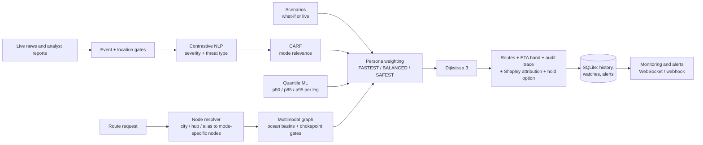

# Supplychainer

**Risk-aware multimodal route planning for global supply chains.**

Supplychainer plans freight routes across sea, air, rail and road, and keeps them honest when the
world changes. It reads disruption signals (scripted scenarios, live news, analyst reports), turns
them into calibrated delay estimates with a quantile ML model, and recommends routes for three
decision styles: *fastest*, *balanced* and *safest*. An executive dashboard shows the options on a
map, explains every number, monitors chosen routes and raises alerts when a new disruption hits them.

<p>


</p>

---

## Contents

1. [Highlights](#highlights)
2. [See it work: the Suez blockage](#see-it-work-the-suez-blockage)
3. [How it works](#how-it-works)
4. [Quick start](#quick-start)
5. [Configuration](#configuration)
6. [Using the dashboard](#using-the-dashboard)
7. [API reference](#api-reference)
8. [Testing](#testing)
9. [Project structure](#project-structure)
10. [Prelim audit: what was broken and how it was fixed](#prelim-audit-what-was-broken-and-how-it-was-fixed)
11. [Known limitations](#known-limitations)
12. [Roadmap](#roadmap)
13. [Tech stack](#tech-stack)

---

## Highlights

| | |
|---|---|
| **Global multimodal graph** | 440 real ports, airports, rail yards and distribution hubs across 370 cities, split into 931 mode-specific nodes and 6,625 edges. Sea lanes are routed through the real chokepoints (Suez, Bab-el-Mandeb, Hormuz, Malacca, Gibraltar, Panama, Cape of Good Hope). |
| **Delay ranges, not guesses** | Gradient-boosted quantile models predict p50 / p85 / p95 delay for every leg. Each route reports an ETA band and a fully-correlated worst case. |
| **Three decision personas** | FASTEST plans on the median, BALANCED on p85, SAFEST on p95 plus risk-hours, so the options diverge for a principled reason when uncertainty grows. |
| **Explainable** | The riskiest leg of every route gets an exact Shapley attribution ("news severity added +122h"). Every ETA, cost and risk figure is traceable in the audit panel. |
| **Disruption scenarios** | Six scripted scenarios (Suez blockage, Red Sea escalation, Hormuz closure, LA port strike, Chennai flooding, Dubai air congestion). Closures are impassable and come with a *hold vs. reroute* comparison. |
| **Live intelligence** | Google News headlines for chokepoints and major hubs, scored by a contrastive NLP model and filtered by mode (CARF). Analysts can file, confirm or dismiss reports. |
| **Route monitoring** | Watch any recommended route. Activating a scenario or receiving new intel re-prices it and pushes an alert with a concrete alternative (WebSocket + optional webhook). |
| **Persistence & exports** | SQLite route history, watches and alerts; CSV audit trail and a TMS/ERP-ready shipment-plan JSON. |
| **Works offline** | The map ships its own coastline and live news degrades gracefully, which suits demos on unreliable Wi-Fi. |

---

## See it work: the Suez blockage

Request: Shanghai → Rotterdam, sea only, with the `SUEZ_BLOCK` scenario.

| | Original prototype | Supplychainer now |
|---|---|---|
| Route | Sails straight through the blocked canal | Malacca → Cape of Good Hope → Rotterdam (all personas) |
| Planned ETA | 649.9 h | 659.3 h |
| Uncertainty | none | p50 721.1 h · p85 733.3 h · p95 749.1 h |
| Wait or reroute? | not considered | Waiting for Suez to reopen is **211.4 h slower** → **REROUTE** |

With the scenario *active* instead of a what-if, any monitored Suez route immediately receives a
**CRITICAL** alert: *"route is impassable at CHOKE-SUEZ. Suggested reroute via CHOKE-MALACCA,
CHOKE-CAPEGOOD (p50 733.4h, $3,461)."*

Other scenarios behave just as concretely. Under `RED_SEA_CONFLICT`, FASTEST keeps the Suez route
(+72 h, 85% threat) while SAFEST and BALANCED take the Cape. Under `HORMUZ_CLOSURE`, cargo from Jebel
Ali is trucked to Sohar, outside the strait, and sails from there.

---

## How it works



### 1. The routing graph
Every hub is split into one node per transport mode it supports (for example `PORT-SHANGHAI:sea`
and `PORT-SHANGHAI:road`). Moving between modes inside a hub is a *transfer* edge that carries its
own time, fee and handling risk. Physical links are two-way. Sea ports are assigned to ocean
basins (`backend/engine/sea_lanes.py`), and any voyage between basins must pass the chokepoints that
actually join them. That's why closing Suez forces the Cape, and why Red Sea or Hormuz events affect
the routes they should.

### 2. Disruption signals
* **Scenarios** (`scenario_manager.py`) mark hubs as delayed, threatened or closed. A what-if applies
  to one request only; an *activated* scenario becomes part of the shared live picture.
* **Live news** (`news_ingestion.py`) scans about 40 chokepoints and major hubs every 15 minutes. A
  headline must name the hub and describe a disruption event before it is scored. Unverified news
  counts at 50% until an analyst confirms it.
* **Analyst reports** are scored the same way at full weight, which also makes the pipeline easy to
  demonstrate without internet access.

### 3. NLP and CARF
A `SentenceTransformer` (`all-MiniLM-L6-v2`) compares each sentence with 16 historical disaster
anchors (Ever Given, Red Sea attacks, port strikes, NotPetya, floods…) and 5 normal-operations
anchors. The margin gives a severity score and the nearest anchor gives a threat type (LABOR,
GEOPOLITICAL, WEATHER, CONGESTION…). The **Context-Aware Relevance Filter** then keeps the threat
for legs of the mode the news is about (or for all modes if the news is mode-agnostic, such as a
war or flood) and drops it for other modes. A port strike therefore doesn't delay a train.

### 4. Quantile delay model
Three `GradientBoostingRegressor` models (quantile loss, α = 0.50 / 0.85 / 0.95) predict leg delay
from origin, destination, mode, weather and news severity. They are trained on 50,000 synthetic leg
delays drawn from distributions fitted to published UNCTAD, World Bank and STB medians and p90s,
with historical incidents injected as outlier clusters (`Code/real_dataset_builder.py`). Hold-out
coverage is 0.51 / 0.85 / 0.95. Predictions are clamped to per-mode calibration bounds and
pre-computed into lookup tables, so routing can query them inside Dijkstra.

### 5. Personas

| Persona | Delay quantile | Edge weight |
|---|---|---|
| FASTEST | p50 | time + delay |
| BALANCED | p85 | 0.3 · time / priority + 0.5 · cost / 150 + 8 · threat |
| SAFEST | p95 | time + delay + 240 h × threat |

`STRICT` mode restricts a route to the chosen mode plus first- and last-mile road; `PREFERRED`
makes other modes 1.5× more expensive. Cargo restrictions apply automatically (perishable: no sea,
hazardous: no air, oversize: no road).

---

## Quick start

**Requirements:** Python 3.11, Node.js 18+ and about 2 GB of disk for PyTorch and the sentence-transformer.

Run everything from the repository root.

### Backend (FastAPI)

```bash
python -m venv .venv
source .venv/bin/activate          # Windows: .venv\Scripts\activate
pip install -r requirements.txt
uvicorn backend.main:app --port 8000
```

The first start downloads the `all-MiniLM-L6-v2` weights and takes 10–20 seconds to warm up.
Interactive API docs are at http://127.0.0.1:8000/docs.

### Frontend (React + Vite)

```bash
cd frontend
npm install
npm run dev
```

Open http://localhost:5173. Vite proxies `/api` and `/ws` to the backend on port 8000.

> If `npm run dev` fails with *permission denied*, run Vite directly:
> `node node_modules/vite/bin/vite.js --port 5173`

### Retraining (optional)

The trained artifacts in `Execution/` are committed, so no dataset is needed to run the app. To
regenerate them:

```bash
python Code/train_quantile_band.py   # p50/p95 models; verifies the retrained p85 matches the shipped one
python Code/precompute_nlp.py        # NLP anchor embeddings
```

---

## Configuration

| Variable | Default | Purpose |
|---|---|---|
| `LIVE_INTEL` | `true` | Scan Google News at startup and on a timer. Set `false` for offline or deterministic runs. |
| `INTEL_REFRESH_S` | `900` | Seconds between live news scans. |
| `SUPPLYCHAINER_DB` | `backend/data/supplychainer.db` | SQLite file for history, watches and alerts. |
| `ALERT_WEBHOOK_URL` | *(unset)* | If set, every route alert is POSTed here as JSON (`supplychainer.route_alert.v1`). |
| `DEMO_MODE` | `false` | Skip model warm-up and use deterministic delay priors. |

---

## Using the dashboard

1. **Plan:** enter an origin and destination (city, hub name or code such as `PORT-SHANGHAI`),
   choose a mode, policy, cargo type and priority, and optionally a *what-if* scenario.
2. **Compare:** each card shows the planned ETA, the p50/p85/p95 band, cost, risk, a plain-language
   explanation built only from real numbers, and the legs. Click a card to highlight it on the map.
3. **Audit:** the *Audit* tab breaks down ETA, the ML delay buffer, cost and risk sources, plus a
   Shapley chart of why the riskiest leg is slow. Export the run as CSV or TMS JSON.
4. **Monitor:** press **Monitor** on a card. In *Live Ops*, activate a scenario or file an intel
   report and any affected route raises an alert with a suggested reroute.
5. **Review:** the *History* tab lists every saved run and reopens it.

The **Supplier Intelligence** view ranks suppliers by cost, lead time and disruption-adjusted
reliability, and gives procurement advice from inventory, safety stock and forecast.

---

## API reference

Full schema at `/docs`. Main endpoints:

| Method & path | Description |
|---|---|
| `POST /api/recommend` | Route options; saved to history and returns a `run_id` |
| `GET /api/history` · `GET /api/runs/{id}` | Saved runs |
| `GET /api/runs/{id}/export.csv` | Leg-level audit trail |
| `GET /api/runs/{id}/export.json` | Shipment plan for TMS/ERP (`supplychainer.shipment_plan.v1`) |
| `GET /api/scenarios` | Scenarios and whether each is live |
| `POST /api/scenarios/{id}/activate` · `/deactivate` | Change the live picture; re-checks monitored routes |
| `POST /api/watches` · `GET /api/watches` · `DELETE /api/watches/{id}` | Route monitoring |
| `GET /api/alerts` · `POST /api/alerts/{id}/ack` | Alerts (also pushed on `/ws`) |
| `GET /api/intel` · `POST /api/intel/scan` · `POST /api/intel/report` · `DELETE /api/intel/{hub}` | Live and analyst intelligence |
| `GET /api/network` · `GET /api/hubs` · `GET /api/hubs/search?q=` · `GET /api/cities` | Registry and map data |
| `POST /api/suppliers` | Supplier ranking and procurement advice |
| `GET /api/status` · `WS /ws` | Engine health; status stream and alert push |

### Example

```bash
curl -s localhost:8000/api/recommend -H 'content-type: application/json' -d '{
  "source": "Shanghai", "destination": "Rotterdam",
  "transport_preference": "sea", "routing_policy": "STRICT",
  "cargo_type": "general", "priority": "normal", "scenario": "SUEZ_BLOCK"
}'
```

Abbreviated response (captured with `LIVE_INTEL=false`, since live headlines change the numbers):

```json
{
  "applied_scenarios": ["SUEZ_BLOCK"],
  "closed_hubs": ["CHOKE-SUEZ"],
  "hold_option": {
    "verdict": "REROUTE",
    "delta_vs_best_reroute_h": 211.4,
    "note": "Waiting for CHOKE-SUEZ to reopen is 211.4h slower (p50) than the best reroute, and depends on the announced reopening estimate holding."
  },
  "recommendations": [{
    "personas": ["FASTEST", "SAFEST", "BALANCED"],
    "chokepoints": ["CHOKE-MALACCA", "CHOKE-CAPEGOOD"],
    "adjusted_eta": 659.3,
    "eta_band": { "p50": 721.1, "p85": 733.3, "p95": 749.1, "p95_correlated": 769.6 },
    "total_cost": 3461.07,
    "audit_trace": {
      "ml": {
        "buffer_h": { "p50": 61.8, "p85": 82.9, "p95": 110.3 },
        "dominant_leg": { "attribution": { "method": "exact_shapley_interventional" } }
      }
    }
  }],
  "run_id": "1133cb7cefa0"
}
```

---

## Testing

```bash
pytest
```

The suite has 80 tests and runs in about 25 seconds once the models are cached. The tests check
outcomes, not just the absence of crashes:

* **Intelligence:** disasters score above 0.5 and safe text scores 0. CARF is enforced for all four
  modes. Quantile bands are ordered and within calibration. Shapley values sum to the prediction.
  Real false-positive headlines from a live scan are rejected.
* **Routing:** no transit edge is one-way and every chokepoint is reachable. Under `SUEZ_BLOCK` no
  option touches Suez, and the hold option contains exactly the 240 h salvage window. Scenario
  delays count once per hub. What-ifs never leak into shared state. Totals match the sum of the legs.
* **API:** history, CSV and TMS exports, alert raising and de-duplication, intel reports feeding
  routing, and supplier what-ifs staying request-scoped.

---

## Project structure

```
.
├── backend/
│   ├── main.py                    FastAPI app: HTTP routes, WebSocket, background intel loop
│   ├── data/
│   │   ├── canonical_hubs.json        440 hubs with modes, coordinates and connections
│   │   ├── canonical_locations.json   city -> hub per mode
│   │   └── suppliers.json             sample suppliers
│   └── engine/
│       ├── multimodal_network.py      builds the mode-split graph
│       ├── sea_lanes.py               ocean basins and chokepoint gates
│       ├── node_resolver.py           city / hub / alias -> entry nodes
│       ├── route_recommender.py       persona weighting, Dijkstra, audit trace, hold option
│       ├── threat_intelligence.py     quantile models, Shapley, contrastive NLP, CARF
│       ├── news_ingestion.py          Google News ingestion and the intel monitor
│       ├── scenario_manager.py        scenarios and the live picture
│       ├── monitoring.py              watches, alerts, CSV / TMS exports
│       ├── store.py                   SQLite persistence
│       └── supplier_scorer.py         supplier ranking and procurement advice
├── Execution/                     trained artifacts: quantile models, encoders, NLP anchors, calibration
├── Code/                          dataset builder, training and anchor scripts
├── frontend/src/
│   ├── App.jsx                    view switcher and WebSocket
│   ├── RouteRecommender.jsx       main dashboard
│   ├── RouteMap.jsx               Leaflet map with offline coastline
│   ├── LiveOps.jsx                scenarios, alerts, watches, intel
│   ├── SupplierIntelligence.jsx   supplier view
│   └── api.js                     fetch helpers and colours
├── tests/                         pytest suite
└── scratch/, benchmarks/          earlier experiments (not part of the app)
```

`Execution/api.py` and the engine modules `baseline.py`, `graph_model.py`, `simulator.py`,
`optimizer.py`, `evaluator.py`, `benchmark_runner.py`, `or_baseline.py`, `weather_integration.py`
and `live_routing.py` belong to an earlier US-only prototype and are not used by the app.

---

## Prelim audit: what was broken and how it was fixed

The original prototype ran without errors but produced wrong numbers and decisions. Everything
below was found by checking outputs against real scenarios.

| Area | Problem | Fix |
|---|---|---|
| NLP threshold | `margin >= noise_floor` returned 0, so real disasters scored 0 | Threat only above the floor |
| NLP calibration | Multiplier 0.35 instead of the research engine's 3.5 | Restored; per-sentence margins so one alarming headline isn't diluted |
| NLP on CPU | CUDA-saved anchors failed to load on CPU, yet warm-up reported success | CPU loading; degraded state reported honestly |
| CARF | Inverted (sea news zeroed for sea legs); rail and road never filtered | Correct logic for all four modes |
| Quantile model | Never called by routing; unknown hubs silently encoded as "Atlanta Air Hub" | Used on every leg; mode prior for unknown hubs |
| Sea graph | 260 of 342 sea links one-way; Cape, Hormuz, Bab-el-Mandeb and Malacca unreachable | Two-way links; basin and chokepoint lane model |
| `SUEZ_BLOCK` | Routes sailed through the blocked canal | Closures impassable; Cape reroute and hold-vs-reroute comparison |
| Red Sea, Hormuz, LA scenarios | Changed nothing, because no route could reach those hubs | Now reroute or re-price |
| Scenario accounting | Delay re-added at every mode change inside a hub; surcharge missing from totals | Once per hub visit; surcharge in `total_cost` |
| Shared state | What-ifs activated globally and leaked between users | Request-scoped what-ifs; explicit live picture |
| Request options | Mode preference, `PREFERRED`, cargo type and priority ignored | All honoured |
| Explanations | Invented figures ("reduces cost by 396%") | Built only from real candidate numbers |
| Registry | Two facilities shared `HUB-CHICAGO`; `AIR-CHENNAI` referenced but missing | Split into `HUB-ELKGROVE`; hub added; duplicate IDs rejected |
| Live news | Never called; process-wide socket timeout | Wired in with per-request timeouts, gates and confidence weighting |
| Supplier risk | "Risk" column was `1 − decision score`, flagging cheap but slow suppliers | Disruption-adjusted unreliability |
| Tests | Scratch checks passed while the bugs were present | 80-test pytest suite with absolute assertions |

---

## Known limitations

* **Model coverage:** the delay model was trained on 16 hubs. Other hubs use a per-mode prior, and
  each route reports how many of its legs did so.
* **Live news precision:** event and location gates remove most noise, but some weak false
  positives remain. That's why unverified news counts at 50% and can be dismissed. Aviation
  headlines still score weakly against the current anchor set.
* **Geometry:** sea distances are great-circle distances between waypoints, not real sailing lanes.
* **Economics:** cargo value and inventory carrying cost are not modelled yet.
* **State:** activated scenarios live in memory; history, watches and alerts are persisted.
* **Legacy:** `BenchmarkCharts.jsx` and `benchmarks/decision_superiority.py` are pre-existing and
  not wired to the current engine.

---

## Roadmap

- [x] Wire the p85 model into live routing
- [x] p50 / p85 / p95 confidence bands
- [x] Explainability (exact Shapley)
- [x] CARF for rail and road
- [x] Threat categorisation
- [x] Interactive map driven by `/api/network`
- [x] Route history and CSV / JSON audit export
- [x] Real-time alerts for affected routes
- [x] Persistent storage (SQLite)
- [x] Automated tests
- [x] Webhook and TMS/ERP export format
- [ ] AIS vessel tracking and structured event feeds
- [ ] Authentication, multi-tenancy and rate limiting
- [ ] PDF boardroom report
- [ ] Cargo value and inventory carrying cost in BALANCED
- [ ] Multi-currency and multi-language UI
- [ ] Postgres and persisted live scenarios

---

## Tech stack

| Layer | Tools |
|---|---|
| Backend | Python 3.11, FastAPI, Uvicorn, NetworkX, SQLite |
| ML / NLP | scikit-learn (quantile gradient boosting), sentence-transformers, PyTorch |
| Data | pandas, NumPy, feedparser, requests |
| Frontend | React 18, Vite 5, Leaflet 1.9, topojson / world-atlas, lucide-react, Recharts |
| Testing | pytest, FastAPI TestClient |

---

## Acknowledgements

Built for the **TatHack** prelim challenge, in association with Arvind and the TatHack team.
Delay distributions are anchored to public statistics from UNCTAD, the World Bank and the US
Surface Transportation Board. Map data © OpenStreetMap contributors, © CARTO, and Natural Earth
(via `world-atlas`).

Licensed under the Apache License 2.0; see [LICENSE](LICENSE).
